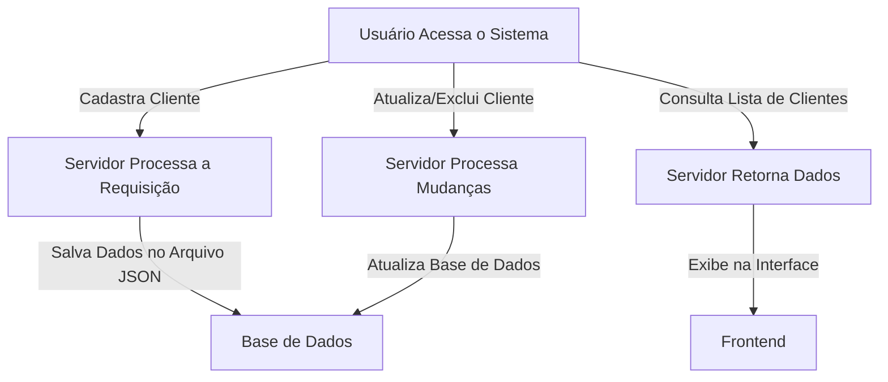

# Sistema de Cadastro de Clientes

## 📌 Sobre o Projeto

O **Sistema de Cadastro de Clientes** é uma aplicação simples desenvolvida em Node.js, HTML, CSS e JavaScript. O sistema permite cadastrar, visualizar, atualizar e deletar informações de clientes, armazenando os dados em uma estrutura local.

## 🛠️ Tecnologias Utilizadas

- **Node.js** - Backend da aplicação
- **Express.js** - Framework para criação de rotas
- **HTML, CSS, JavaScript** - Frontend
- **FS (File System)** - Para manipulação de arquivos JSON como banco de dados

## 📂 Estrutura do Projeto

```
projeto-cadastro-clientes/
├── assets/           # Recursos estáticos
├── database/         # Arquivo JSON para armazenar dados
├── css/              # Estilos da interface
├── js/               # Scripts do frontend
├── handlers/         # Lógica para manipulação de dados
├── server.js         # Servidor principal
├── package.json      # Dependências do projeto
└── README.md         # Documentação
```

## 🚀 Instalação e Execução

### 1️⃣ Clone o repositório:
```bash
git clone https://github.com/seuusuario/projeto-cadastro-clientes.git
cd projeto-cadastro-clientes
```

### 2️⃣ Instale as dependências:
```bash
npm install
```

### 3️⃣ Inicie o servidor:
```bash
node server.js
```

A aplicação ficará disponível em **http://localhost:3000**.

## 🔄 Fluxo do Sistema



## 📌 Endpoints da API

| Método | Rota           | Descrição |
|---------|---------------|------------|
| GET     | `/clientes`    | Retorna a lista de clientes |
| POST    | `/clientes`    | Cadastra um novo cliente |
| PUT     | `/clientes/:id` | Atualiza os dados de um cliente |
| DELETE  | `/clientes/:id` | Remove um cliente |

## 📧 Contato

Desenvolvido por **[Seu Nome]** - Entre em contato pelo [seuemail@dominio.com](mailto:seuemail@dominio.com).
