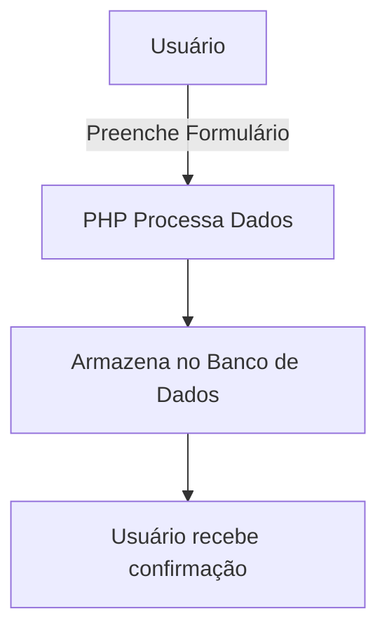

# Projeto: Cadastro de Clientes

## Estrutura do Projeto

```mermaid
graph TD;
    A[Usuário] -->|Preenche Formulário| B[PHP Processa Dados];
    B --> C[Armazena no Banco de Dados];
    C --> D[Usuário recebe confirmação];

```